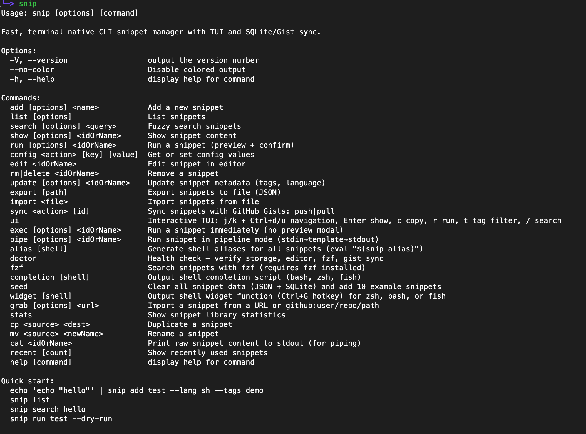
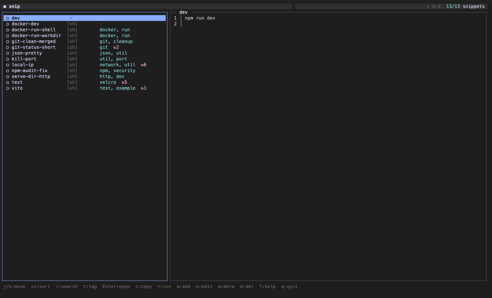

<h1 align="center">snip</h1>

<p align="center">
  <strong>Your terminal's memory.</strong><br>
  Save, search, and execute code snippets in milliseconds.
</p>

<p align="center">
  <a href="https://www.npmjs.com/package/snip-manager"></a>
  <a href="https://www.npmjs.com/package/snip-manager"></a>
  <a href="https://github.com/Bharath-code/snip/actions"></a>
  <a href="https://codecov.io/gh/Bharath-code/snip"></a>
  <a href="https://github.com/Bharath-code/snip/blob/main/LICENSE"></a>
  <a href="https://www.npmjs.com/package/snip-manager"></a>
</p>

<p align="center">
  <a href="https://bharath-code.github.io/snip/">Website</a> ·
  <a href="#quick-start">Quick Start</a> ·
  <a href="#commands">Commands</a> ·
  <a href="docs/demo.md">Demo</a> ·
  <a href="#configuration">Configuration</a> ·
  <a href="CONTRIBUTING.md">Contributing</a>
</p>

---

<p align="center">
  
</p>
<p align="center">
  
</p>

## Why snip?

Most snippet managers only handle shell commands. **snip** handles _code_ — deploy scripts, API calls, Docker commands, JS utilities — across any language, with safety rails, a real TUI, and unix pipeline integration.

| Feature | snip | [pet](https://github.com/knqyf263/pet) | [navi](https://github.com/denisidoro/navi) | [tldr](https://github.com/tldr-pages/tldr) | dotfiles |
|---------|------|-----|------|------|--------|
| Run snippets directly | ✅ Any language | ✅ Shell only | ✅ Shell only | ❌ | ✅ Shell only |
| Multi-language (JS, Python, Ruby…) | ✅ | ❌ | ❌ | ❌ | ❌ |
| Unix pipeline integration | ✅ `snip pipe` | ❌ | ❌ | ❌ | ❌ |
| Interactive TUI | ✅ Split-pane | ❌ | ✅ Basic | ❌ | ❌ |
| Dangerous command detection | ✅ | ❌ | ❌ | ❌ | ❌ |
| fzf integration | ✅ Native | ✅ | ✅ | ❌ | Manual |
| SQLite backend | ✅ Optional | ❌ | ❌ | ❌ | ❌ |
| Gist sync | ✅ | ✅ | ❌ | ❌ | Manual |
| Zero config | ✅ | ✅ | Needs cheats | ✅ | Heavy |
| Shell widget (Ctrl+G) | ✅ | ❌ | ❌ | ❌ | ❌ |
| Template variables | ✅ `{{var:default}}` | ❌ | ✅ | ❌ | ❌ |
| Statistics & streaks | ✅ | ❌ | ❌ | ❌ | ❌ |
| Import from URL | ✅ `snip grab` | ❌ | ❌ | ❌ | ❌ |

## Quick Start

```bash
# Install
npm install -g snip-manager

# Save a snippet
echo 'docker compose up -d --build' | snip add dc-up --lang sh --tags docker

# Find it
snip search docker

# Run it
snip exec dc-up

# Launch TUI
snip ui
```

## Installation

**Prerequisites:** Node.js ≥ 18

```bash
# npm
npm install -g snip-manager

# yarn
yarn global add snip-manager

# pnpm
pnpm add -g snip-manager

# verify
snip --version
snip doctor          # validates storage, editor, fzf, shell, gist
```

### Quick Setup with `snip init`

First time? Run the guided setup wizard:

```bash
snip init
```

This interactive wizard will:
1. ✍️  Set your preferred editor (`vim`, `code`, `nano`, etc.)
2. ⌨️  Install the Ctrl+G shell widget for your shell (zsh/bash/fish)
3. 📦  Seed 10 example snippets to get you started
4. 🎨  Optionally launch the TUI for a quick tour

**Goal:** Zero to "aha moment" in under 60 seconds.

## Commands

### Core

| Command | Description |
|---------|-------------|
| `snip add <name>` | Save a snippet from stdin or `$EDITOR` |
| `snip list` | List all snippets (`--json`, `--tag`, `--lang`, `--sort`, `--limit`) |
| `snip search <query>` | Fuzzy search (`--json`, `--limit`) |
| `snip show <name>` | Display snippet (`--json`, `--raw`, `--edit`) |
| `snip run <name>` | Preview + confirm + execute (with template prompts) |
| `snip exec <name>` | Execute immediately, no modal (`--dry-run`, `--force`) |
| `snip pipe <name>` | Pipeline mode — stdin→template→stdout (`--json`, `--dry-run`) |
| `snip edit <name>` | Open in `$EDITOR` |
| `snip rm <name>` | Delete (alias: `delete`) |
| `snip update <name>` | Update metadata (`--tags`, `--lang`) |
| `snip last` | Re-run the last executed snippet |
| `snip recent [n]` | Show last _n_ used snippets (default: 5) |

### AI-Powered Generation

| Command | Description |
|---------|-------------|
| `snip ai generate "<prompt>"` | Generate a snippet using AI (requires OpenAI API key) |
| | Options: `--lang`, `--tags`, `--name`, `--model` |

```bash
# Set up OpenAI API key
export SNIP_AI_API_KEY="your-openai-api-key"

# Generate a Docker health check
snip ai generate "docker container health check"

# Generate a Python web server
snip ai generate "simple flask server" --lang python --tags web,api

# Generate with custom name and model
snip ai generate "curl wrapper with retry" --name curl-retry --model gpt-4
```

### Utilities

| Command | Description |
|---------|-------------|
| `snip cp <src> <dest>` | Duplicate a snippet |
| `snip mv <old> <new>` | Rename a snippet |
| `snip cat <name>` | Print raw content to stdout (for piping) |
| `snip stats` | Library statistics (`--json`, language chart, top tags, `--streak`) |
| `snip import-history` | Suggest commands from shell history run 3+ times (`--last`, `--min-count`) |
| `snip grab <url>` | Import from URL or `github:user/repo/path` |
| `snip fzf` | fzf search with live preview |
| `snip seed` | Clear data and add 10 example snippets |

### Integration

| Command | Description |
|---------|-------------|
| `snip alias [shell]` | Generate shell aliases (`eval "$(snip alias)"`) |
| `snip widget [shell]` | Ctrl+G hotkey widget for zsh/bash/fish |
| `snip completion [shell]` | Tab-completion script (bash, zsh, fish) |
| `snip sync push [query]` | Push to GitHub Gist |
| `snip sync pull <id>` | Pull from GitHub Gist |
| `snip doctor` | Health check |
| `snip config <action>` | Get / set configuration |
| `snip ui` | Interactive TUI |
| `snip init` | Guided setup (editor, widget, example snippets, optional TUI) |

### Import/Export

| Command | Description |
|---------|-------------|
| `snip export [path]` | Export snippets to JSON file |
| `snip import <file>` | Import snippets from JSON file |

## Features

### Interactive TUI

```bash
snip ui
```

Split-pane interface with fuzzy search with **Catppuccin Mocha** color palette. Keyboard shortcuts:

| Key | Action |
|-----|--------|
| `j` / `k` or `↑` / `↓` | Navigate |
| `Ctrl+u` / `Ctrl+d` | Page up/down |
| `/` | Live search |
| `Enter` | Preview |
| `c` | Copy to clipboard |
| `r` | Run |
| `e` | Edit |
| `a` | Add new |
| `d` | Delete (type name to confirm, `z` to undo within 5s) |
| `t` | Tag filter |
| `s` | Cycle sort mode |
| `q` | Quit |

**First time?** The TUI shows helpful overlays and keybinding hints on first launch.

### Zero-Friction Execution

```bash
snip exec deploy-api            # run immediately
snip exec deploy-api --dry-run  # print only
snip exec deploy-api --force    # skip safety warning
```

**Safety First:** Dangerous commands (`rm -rf`, `sudo`, system-level ops) are detected automatically. `snip run` shows a preview and requires explicit confirmation. `snip exec` warns but lets you `--force` past.

> **Tip:** Use `snip run` for interactive use (preview + confirm), `snip exec` for scripts (no prompts).

### Parameterized Snippets

Use `{{variable}}` or `{{variable:default}}` syntax:

```bash
echo 'docker run --rm -it {{image:ubuntu:24.04}} {{cmd:bash}}' \
  | snip add docker-dev --lang sh --tags docker

snip run docker-dev
#   image [ubuntu:24.04]: node:20
#   cmd [bash]: ↵
```

Variables are auto-detected at runtime — no extra flags needed.

### Safety

Dangerous commands (`rm -rf`, `sudo`, system-level ops) are detected automatically. `snip run` shows a preview and requires explicit confirmation. `snip exec` warns but lets you `--force` past.

### Shell Aliases

```bash
eval "$(snip alias)"        # every snippet becomes a command
deploy-api                  # → snip exec deploy-api
```

### Ctrl+G Widget

```bash
# add to ~/.zshrc
eval "$(snip widget zsh)"
# press Ctrl+G anywhere → search → paste snippet inline
```

### Gist Sync

```bash
snip sync push               # push all
snip sync push docker        # push matching
snip sync pull <gist-id>     # pull
```

### fzf Integration

```bash
snip fzf                     # search + preview
snip fzf | pbcopy            # pipe to clipboard
```

### Pipeline Mode

```bash
# Run a snippet, pipe output forward
snip pipe deploy-api | tee /tmp/deploy.log

# Pipe JSON as template values — no interactive prompts
echo '{"host":"prod.api.com","branch":"main"}' | snip pipe deploy --json

# Stdin passthrough to the snippet's process
curl -s https://api.example.com/data | snip pipe parse-json

# Dry-run: see resolved content without executing
echo '{"image":"node:20"}' | snip pipe docker-dev --json --dry-run
```

Pipeline mode is perfect for:
- **CI/CD workflows** — pipe deployment outputs to logs
- **JSON processing** — chain snippets with `jq` or other tools
- **Automation scripts** — resolve templates programmatically
- **Zero-chrome output** — clean stdout for piping

Also pipe-friendly: `snip cat`, `snip show --raw`, `snip list --json`, `snip search --json`.

### Grab from URL

```bash
snip grab https://example.com/script.sh --tags ops
snip grab github:user/repo/scripts/backup.sh
```

Language auto-detected from extension and shebang.

### Shell History Import

Turn your repeated shell commands into snippets automatically:

```bash
snip import-history --last 500
```

Analyzes your last 500 shell commands, finds those run 3+ times, and suggests saving them as snippets. Perfect for discovering your own "muscle memory" commands.

### Re-run Last Snippet

```bash
snip last
```

Instantly re-run the last executed snippet. Like `!!` but for your snippet library.

## Pro Tips

```bash
# Create a snippet from a GitHub gist
snip grab https://gist.github.com/user/123456 --tags utility

# Copy snippet to clipboard
snip fzf | pbcopy        # macOS
snip fzf | xclip         # Linux

# View snippet statistics
snip stats --json | jq '.totalSnippets'

# Check your usage streak
snip stats --streak

# Find recently used snippets
snip recent 10

# Export your entire library
snip export ~/snippets-backup.json

# Import from a backup
snip import ~/snippets-backup.json

# Duplicate and modify a snippet
snip cp deploy-staging deploy-prod
snip edit deploy-prod
```

## Configuration

```bash
snip config set editor "code --wait"
snip config set useSqlite true       # for 100+ snippets
snip config set ai_model gpt-4       # AI model for generation
snip config list
```

| Option | Default | Description |
|--------|---------|-------------|
| `editor` | `$EDITOR` / `vi` | Snippet editor |
| `useSqlite` | `false` | SQLite instead of JSON |
| `snippetDir` | `~/.snip` | Data directory |
| `ai_provider` | `openai` | AI provider (currently only OpenAI) |
| `ai_model` | `gpt-3.5-turbo` | AI model for generation |
| `ai_max_tokens` | `1000` | Max tokens to generate |
| `ai_api_key` | - | OpenAI API key (use `SNIP_AI_API_KEY` env var) |

### AI Setup

1. **Set API key (recommended):**
   ```bash
   export SNIP_AI_API_KEY="sk-..."
   ```

2. **Or store in config:**
   ```bash
   snip config set ai_api_key "sk-..."
   # Warning: Key will be stored in plain text
   ```

3. **Generate your first snippet:**
   ```bash
   snip ai generate "curl with retry logic"
   ```

**Validation:** `snip config` validates allowed keys and types, rejecting invalid values with helpful error messages.

SQLite uses `better-sqlite3` (native module) or falls back to `sql.js` (WASM). If `better-sqlite3` is missing, `snip doctor` will suggest installing it with `npm install -g better-sqlite3`.

## Architecture

```
snip
├── bin/snip              # Entry point
├── lib/
│   ├── cli.js            # Command definitions (Commander.js)
│   ├── storage.js        # JSON + SQLite abstraction
│   ├── search.js         # Fuse.js fuzzy search
│   ├── exec.js           # Multi-language runner
│   ├── template.js       # {{var:default}} engine
│   ├── safety.js         # Dangerous command detection
│   ├── config.js         # Config loader
│   ├── colors.js         # Unified brand color palette
│   ├── clipboard.js      # Cross-platform clipboard support
│   ├── lock.js           # Concurrency lock for storage
│   ├── migrate_to_sqlite.js  # JSON → SQLite migration
│   ├── readline.js       # Interactive prompts
│   ├── streak.js         # Usage streak tracking
│   ├── sync/             # Gist sync module
│   └── commands/         # One file per command (20+)
├── completions/          # Shell completions (bash, zsh, fish)
├── __tests__/            # Jest test suite
├── scripts/              # Seed / smoke scripts
└── docs/                 # Website + demo
```

**Design decisions:**

- **Commander.js** for CLI parsing — battle-tested, zero-config subcommands.
- **Fuse.js** for fuzzy search — searches name, tags, and content simultaneously.
- **Dual storage** — JSON for instant start, SQLite for scale. Same API, swap with one config.
- **No daemon** — every invocation is stateless. Fast cold starts.
- **Blessed** for TUI — raw terminal control, no React/Ink overhead.
- **Unified brand colors** — `#ff4d00` orange across all CLI output.

## Development

```bash
git clone https://github.com/Bharath-code/snip.git
cd snip
npm install

# Run locally
node bin/snip --help

# Seed example snippets
node bin/snip seed

# Run tests
npm test

# Lint code
npm run lint
```

### Testing

Tests use [Jest](https://jestjs.io/) and cover storage, search, template engine, exec, safety, and CLI integration.

```bash
npm test                     # run all tests
npx jest --verbose           # verbose output
npx jest __tests__/exec.test.js  # single file
```

### Project Structure for Contributors

| Directory | Purpose |
|-----------|---------|
| `lib/commands/` | Add a new command = add one file here + register in `cli.js` |
| `lib/storage.js` | Storage abstraction — both backends |
| `__tests__/` | Mirror of `lib/` — one test file per module |
| `completions/` | Shell completion scripts |

## Troubleshooting

<details>
<summary><b>"command not found: snip"</b></summary>

Ensure npm's global bin is in your PATH:

```bash
export PATH="$(npm prefix -g)/bin:$PATH"
```

</details>

<details>
<summary><b>Editor not opening</b></summary>

```bash
snip config set editor "vim"     # or code, nvim, nano, subl
```

</details>

<details>
<summary><b>GitHub token errors with Gist sync</b></summary>

If you see 401 errors when pushing/pulling gists:

```bash
# Set a valid GitHub PAT (Personal Access Token)
export SNIP_GIST_TOKEN=your_token_here
```

Generate a token at https://github.com/settings/tokens with `gist` scope.

</details>

<details>
<summary><b>SQLite mode errors</b></summary>

If `snip config set useSqlite true` causes errors:

```bash
# Install the native SQLite module
npm install -g better-sqlite3

# Or continue using JSON backend (default)
snip config set useSqlite false
```

`snip doctor` will detect and suggest fixes for SQLite issues.

</details>

<details>
<summary><b>Permission errors on global install</b></summary>

Use [nvm](https://github.com/nvm-sh/nvm) to avoid `sudo`:

```bash
nvm install --lts
npm install -g snip-manager
```

</details>

## Roadmap

### Shipped in v0.4.0
- [x] `snip pipe` — stdin pipeline integration (`--json`, `--dry-run`)
- [x] `snip stats --json` — machine-readable statistics
- [x] `snip stats --streak` — days-in-a-row usage tracking
- [x] `snip recent` — recently used snippets
- [x] `snip last` — re-run last executed snippet
- [x] `snip cp` / `snip mv` / `snip cat` — snippet management utilities
- [x] `snip seed` — example snippets for onboarding
- [x] `snip completion` — shell completion scripts (bash, zsh, fish)
- [x] `snip init` — guided setup wizard
- [x] `snip import-history` — import repeated commands from shell history
- [x] `snip doctor` — enhanced with widget check, SQLite detection, better error messages
- [x] Unified brand colors (`#ff4d00`) across CLI output
- [x] Catppuccin Mocha TUI theme with first-run overlays
- [x] Config validation with type checking
- [x] Improved error messages with next-step guidance

### Planned
- [ ] Snippet groups / namespaces (`docker/cleanup`, `k8s/deploy`)
- [ ] Snippet versioning & history
- [ ] `snip share` — single-snippet gist sharing
- [ ] `snip diff a b` — diff two snippets
- [ ] `snip watch <name>` — re-run snippet on file edit
- [ ] AI snippet generation (`snip ai generate "..."`)
- [ ] Team shared snippets
- [ ] VS Code / Neovim extension

See [CHANGELOG.md](CHANGELOG.md) for release history.

## FAQ

<details>
<summary><b>What is snip?</b></summary>

A CLI tool for saving and running code snippets from the terminal. Think of it as a personal, searchable library for commands and code blocks you run repeatedly.
</details>

<details>
<summary><b>How is snip different from dotfiles?</b></summary>

Dotfiles store configuration. snip stores **executable snippets** — commands and code blocks you run. snip provides instant search, multi-language execution, and safety rails.
</details>

<details>
<summary><b>Does snip support custom languages?</b></summary>

Yes. Use `--lang` to specify any language. snip resolves the interpreter (node, python3, ruby, etc.) automatically.
</details>

<details>
<summary><b>Is my data secure?</b></summary>

Snippets are stored locally in `~/.snip/`. Nothing leaves your machine unless you explicitly `snip sync push` to GitHub Gist.
</details>

## Contributing

Contributions welcome. See [CONTRIBUTING.md](CONTRIBUTING.md) for setup and guidelines.

```bash
# Good first issues
# https://github.com/Bharath-code/snip/labels/good%20first%20issue
```

## Community

- [Issues](https://github.com/Bharath-code/snip/issues) — Bug reports & feature requests
- [Discussions](https://github.com/Bharath-code/snip/discussions) — Questions & ideas
- [Security Policy](SECURITY.md) — Vulnerability reporting

## License

[MIT](LICENSE) © [Bharath](https://github.com/Bharath-code)
